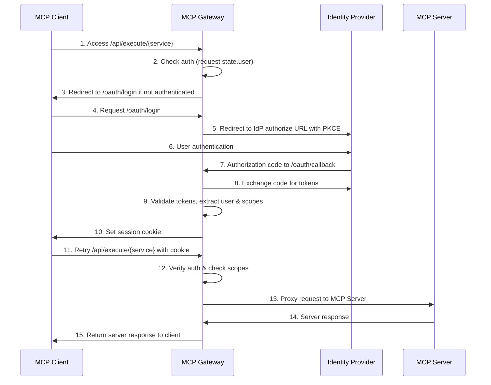

# MCP Gateway OAuth 2.1 Integration

This guide covers everything you need to know about using OAuth 2.1 with MCP Gateway, including configuration, setup, and practical examples.

## Table of Contents

1. [Overview](#overview)
2. [Features and Capabilities](#features-and-capabilities)
3. [Setup and Configuration](#setup-and-configuration)
   - [AWS Cognito Setup](#aws-cognito-setup)
   - [Okta Setup](#okta-setup)
   - [Generic OAuth Provider Setup](#generic-oauth-provider-setup)
4. [Scope-Based Access Control](#scope-based-access-control)
5. [Transport Protocol Support](#transport-protocol-support)
6. [Configuration Reference](#configuration-reference)
   - [Environment Variables](#environment-variables)
   - [JSON Configuration](#json-configuration)
7. [End-to-End Authentication](#end-to-end-authentication)
8. [Deployment Examples](#deployment-examples)
9. [Troubleshooting](#troubleshooting)

## Overview

MCP Gateway implements OAuth 2.1 for secure authentication, allowing you to:

- Control access to the MCP Gateway Registry and its servers
- Integrate with popular identity providers (AWS Cognito, Okta, others)
- Implement fine-grained permissions using scope-based access control
- Support both SSE and StreamableHTTP transport protocols
- Pass service-specific tokens for end-to-end authentication

The authentication flow follows the OAuth 2.1 authorization code flow with PKCE (Proof Key for Code Exchange) for enhanced security:



## Features and Capabilities

MCP Gateway's OAuth 2.1 implementation includes:

- **Multiple Identity Provider Support**:
  - AWS Cognito (fully implemented and tested)
  - Okta (implemented)
  - Generic OAuth 2.1 providers (implemented with configuration options)

- **Secure Authentication**:
  - OAuth 2.1 authorization code flow with PKCE
  - JWT validation and signature verification
  - Session management with proper token handling

- **Fine-Grained Access Control**:
  - Registry-level permissions (admin, read)
  - Server-level permissions (execute, read, toggle, edit)
  - Tool-specific permissions

- **Multiple Transport Protocol Support**:
  - Server-Sent Events (SSE) via `/api/execute/{service}` endpoint
  - StreamableHTTP via `/api/streamable/{service}` endpoint
  - Dynamically generated nginx configuration for both transports

- **End-to-End Authentication**:
  - Direct parameter approach for service-specific tokens

- **Flexible Configuration**:
  - Environment variables
  - JSON configuration files
  - Runtime scope mapping


## Scope-Based Access Control

MCP Gateway uses a scope-based permission system mapped to identity provider groups:

### Standard Scopes

| Scope | Description |
|-------|-------------|
| `mcp:registry:admin` | Full administrative access to the registry |
| `mcp:registry:read` | Read-only access to the registry |
| `mcp:server:{name}:execute` | Permission to use a specific server |
| `mcp:server:{name}:read` | Read-only access to a specific server |
| `mcp:server:{name}:toggle` | Permission to enable/disable a server |
| `mcp:server:{name}:edit` | Permission to edit a server's configuration |
| `mcp:server:{name}:tool:{tool}:execute` | Permission to use a specific tool |

### Group to Scope Mapping

MCP Gateway maps IdP groups to MCP Gateway scopes using this convention:

| Group Name | Resulting Scopes |
|------------|------------------|
| `mcp-admin` | `mcp:registry:admin` |
| `mcp-user` | `mcp:registry:read` |
| `mcp-server-{name}` | `mcp:server:{name}:read`, `mcp:server:{name}:execute` |
| `mcp-server-{name}-admin` | All server scopes for the named server |
| `mcp-server-{name}-toggle` | `mcp:server:{name}:toggle` |
| `mcp-server-{name}-edit` | `mcp:server:{name}:edit` |
| `mcp-server-{name}-tool-{tool}` | `mcp:server:{name}:tool:{tool}:execute` |

## Transport Protocol Support

MCP Gateway supports both transport protocols defined in the MCP specification:

### Server-Sent Events (SSE)

The SSE transport is accessed through the `/api/execute/{service}` endpoint:

- **Description**: A streaming protocol where the server sends a continuous stream of events to the client
- **HTTP Method**: POST to initiate, then GET for the SSE stream
- **Endpoint**: `/api/execute/{service}`
- **Authentication**: Requires valid session cookie with appropriate scopes
- **Headers**:
  - `Content-Type: application/json` for the request
  - `Accept: text/event-stream` for the response

### StreamableHTTP

The StreamableHTTP transport is accessed through the `/api/streamable/{service}` endpoint:

- **Description**: A bidirectional HTTP transport with request and response bodies
- **HTTP Method**: POST
- **Endpoint**: `/api/streamable/{service}`
- **Authentication**: Requires valid session cookie with appropriate scopes
- **Headers**:
  - `Content-Type: application/json` for the request

### Example Usage

#### SSE Transport (Python)

```python
from mcp.client.sse import SSEClient

# Create SSE client with session cookie authentication
client = SSEClient(
    base_url="https://your-gateway.example.com/api/execute/currenttime",
    cookies={"mcp_gateway_session": session_cookie}
)

# Execute tool
result = await client.execute_tool(
    "current_time_by_timezone",
    {"params": {"tz_name": "America/New_York"}}
)
```

#### StreamableHTTP Transport (Python)

```python
from mcp.client.streamable_http import StreamableHTTPClient

# Create StreamableHTTP client with session cookie authentication
client = StreamableHTTPClient(
    base_url="https://your-gateway.example.com/api/streamable/currenttime",
    cookies={"mcp_gateway_session": session_cookie}
)

# Execute tool
result = await client.execute_tool(
    "current_time_by_timezone",
    {"params": {"tz_name": "America/New_York"}}
)
```

## Setup and Configuration

### AWS Cognito Setup

#### 1. Create a Cognito User Pool

1. Go to the AWS Management Console and navigate to Amazon Cognito
2. Create a new user pool with these key settings:
   - Sign-in options: Email
   - Security requirements: According to your needs
   - Required attributes: Email
   - App client: Confidential client type
   - Callback URL: `http://localhost:7860/oauth/callback/cognito` (add your domain for production)
   - OAuth grant types: Authorization code

#### 2. Set Up Groups for Access Control

Create the following groups in your Cognito user pool:

```bash
# Admin access
aws cognito-idp create-group \
    --user-pool-id YOUR_USER_POOL_ID \
    --group-name mcp-admin \
    --description "Full administrative access"

# Basic user access
aws cognito-idp create-group \
    --user-pool-id YOUR_USER_POOL_ID \
    --group-name mcp-user \
    --description "Read-only access"

# Server-specific access
aws cognito-idp create-group \
    --user-pool-id YOUR_USER_POOL_ID \
    --group-name mcp-server-currenttime \
    --description "Access to currenttime server"

# Server toggle permission
aws cognito-idp create-group \
    --user-pool-id YOUR_USER_POOL_ID \
    --group-name mcp-server-currenttime-toggle \
    --description "Permission to toggle currenttime server"

# Tool-specific access
aws cognito-idp create-group \
    --user-pool-id YOUR_USER_POOL_ID \
    --group-name mcp-server-currenttime-tool-current_time_by_timezone \
    --description "Access to specific tool"
```

#### 3. Create Test Users

```bash
# Create admin user
aws cognito-idp admin-create-user \
    --user-pool-id YOUR_USER_POOL_ID \
    --username admin@example.com \
    --user-attributes Name=email,Value=admin@example.com Name=email_verified,Value=true

# Set password
aws cognito-idp admin-set-user-password \
    --user-pool-id YOUR_USER_POOL_ID \
    --username admin@example.com \
    --password "SecurePassword123!" \
    --permanent

# Add to groups
aws cognito-idp admin-add-user-to-group \
    --user-pool-id YOUR_USER_POOL_ID \
    --username admin@example.com \
    --group-name mcp-admin
```

#### 4. Configure MCP Gateway for Cognito

```bash
# Basic OAuth settings
export MCP_AUTH_ENABLED=true
export MCP_AUTH_PROVIDER_TYPE=cognito
export SECRET_KEY=$(python3 -c 'import secrets; print(secrets.token_hex(32))')

# Cognito-specific settings
export MCP_AUTH_COGNITO_USER_POOL_ID=YOUR_USER_POOL_ID
export MCP_AUTH_COGNITO_CLIENT_ID=YOUR_CLIENT_ID
export MCP_AUTH_COGNITO_CLIENT_SECRET=YOUR_CLIENT_SECRET
export MCP_AUTH_COGNITO_CALLBACK_URI=http://localhost:7860/oauth/callback/cognito
export MCP_AUTH_COGNITO_REGION=YOUR_AWS_REGION
```

### Okta Setup

#### 1. Create an Okta Application

1. Sign in to the Okta Admin Console
2. Create a new app integration:
   - Sign-in method: OIDC - OpenID Connect
   - Application type: Web Application
   - Grant types: Authorization Code
   - Sign-in redirect URIs: `http://localhost:7860/oauth/callback/okta`
   - Assignments: Assign to groups

#### 2. Create Groups for Access Control

Create the following groups in Okta:
- mcp-admin
- mcp-user
- mcp-server-{servername}
- mcp-server-{servername}-toggle

#### 3. Configure MCP Gateway for Okta

```bash
# Basic OAuth settings
export MCP_AUTH_ENABLED=true
export MCP_AUTH_PROVIDER_TYPE=okta
export SECRET_KEY=$(python3 -c 'import secrets; print(secrets.token_hex(32))')

# Okta-specific settings
export MCP_AUTH_OKTA_TENANT_URL=https://your-domain.okta.com
export MCP_AUTH_OKTA_CLIENT_ID=YOUR_CLIENT_ID
export MCP_AUTH_OKTA_CLIENT_SECRET=YOUR_CLIENT_SECRET
export MCP_AUTH_OKTA_CALLBACK_URI=http://localhost:7860/oauth/callback/okta
```

### Generic OAuth Provider Setup

For other OAuth 2.1 providers:

```bash
# Basic OAuth settings
export MCP_AUTH_ENABLED=true
export MCP_AUTH_PROVIDER_TYPE=generic
export SECRET_KEY=$(python3 -c 'import secrets; print(secrets.token_hex(32))')

# Provider settings
export MCP_AUTH_CLIENT_ID=YOUR_CLIENT_ID
export MCP_AUTH_CLIENT_SECRET=YOUR_CLIENT_SECRET
export MCP_AUTH_AUTHORIZE_URL=https://your-provider.com/oauth2/authorize
export MCP_AUTH_TOKEN_URL=https://your-provider.com/oauth2/token
export MCP_AUTH_JWKS_URL=https://your-provider.com/.well-known/jwks.json
export MCP_AUTH_CALLBACK_URI=http://localhost:7860/oauth/callback
export MCP_AUTH_SCOPES="openid profile email"
export MCP_AUTH_ISSUER=https://your-provider.com
```

## End-to-End Authentication

MCP Gateway supports passing service-specific tokens (like GitHub, AWS) to MCP tools. Currently, the direct parameter approach can be leveraged:

### Direct Parameter Approach

This approach passes service-specific tokens directly as parameters to the tool:

```python
@mcp.tool()
async def get_github_repos(
    github_token: str = Field(..., description="GitHub Personal Access Token"),
    username: str = Field(..., description="MCP Gateway username"),
    password: str = Field(..., description="MCP Gateway password"),
    # Other parameters...
) -> Dict[str, Any]:
    # First authenticate with MCP Gateway
    auth_credentials = Credentials(username=username, password=password)
    await _ensure_authenticated(auth_credentials)
    
    # Use GitHub token for API calls
    headers = {
        "Authorization": f"token {github_token}",
        "Accept": "application/vnd.github.v3+json"
    }
    
    # Make GitHub API calls and return results
    # ...
```
## Deployment Examples

### Docker Deployment with Cognito

```bash
docker run -p 80:80 -p 443:443 -p 7860:7860 \
  -e ADMIN_USER=admin \
  -e ADMIN_PASSWORD=password \
  -e SECRET_KEY=$(python3 -c 'import secrets; print(secrets.token_hex(32))') \
  -e MCP_AUTH_ENABLED=true \
  -e MCP_AUTH_PROVIDER_TYPE=cognito \
  -e MCP_AUTH_COGNITO_USER_POOL_ID=YOUR_USER_POOL_ID \
  -e MCP_AUTH_COGNITO_CLIENT_ID=YOUR_CLIENT_ID \
  -e MCP_AUTH_COGNITO_CLIENT_SECRET=YOUR_CLIENT_SECRET \
  -e MCP_AUTH_COGNITO_CALLBACK_URI=http://localhost:7860/oauth/callback/cognito \
  -e MCP_AUTH_COGNITO_REGION=us-east-1 \
  -v $(pwd)/logs:/app/logs \
  -v $(pwd)/registry/servers:/app/registry/servers \
  --name mcp-gateway-container mcp-gateway
```

## Troubleshooting

### Common Issues and Solutions

#### 1. Authentication Failures

- **Invalid Redirect URI Error**:
  - Ensure the callback URI in IdP settings exactly matches the one in MCP Gateway
  - Check for protocol mismatches (http vs https)

- **Invalid Client Error**:
  - Verify client ID and client secret
  - Ensure the client is allowed to use the authorization code grant

- **Token Validation Errors**:
  - Check if JWKS endpoint is accessible
  - Verify issuer and audience configuration
  - Look for clock skew between servers

#### 2. Permission Issues

- **Access Denied Errors**:
  - Confirm user is in the correct groups in the IdP
  - Verify group naming convention follows the required pattern
  - Check scope mapping configuration

#### 3. JWT Validation Issues

- **Signature Verification Failures**:
  - Ensure JWKS URL is correct and accessible
  - Check if token is properly formatted

### Debugging

To enable detailed debug logging:

```bash
export LOGGING_LEVEL=DEBUG
```

Monitor authentication logs:

```bash
docker logs -f mcp-gateway-container | grep -i 'auth\|scope\|access'
```

### Security Best Practices

1. **Always use HTTPS** in production environments
2. **Minimize token scope** to follow least privilege principle
3. **Use short-lived tokens** and implement proper refresh logic
4. **Enable MFA** in your identity provider
5. **Log and monitor** authentication attempts

---

## Further Resources

- [OAuth 2.1 Specification](https://datatracker.ietf.org/doc/html/draft-ietf-oauth-v2-1-09)
- [AWS Cognito Documentation](https://docs.aws.amazon.com/cognito/latest/developerguide/cognito-user-pools.html)
- [Okta Developer Documentation](https://developer.okta.com/docs/guides/)